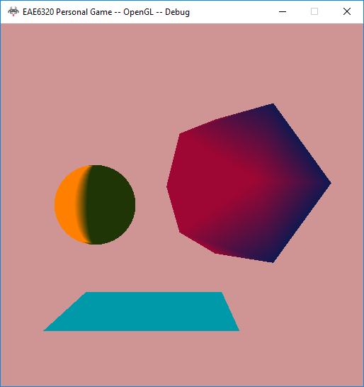
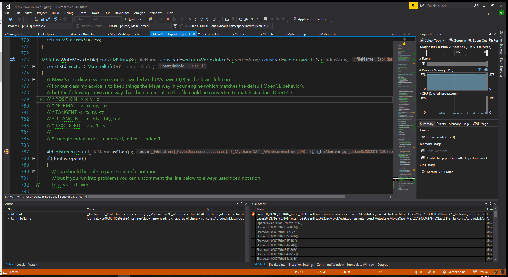

<a href="https://drive.google.com/open?id=1IgNfRG39Bc5zX6lHRF0vqupWJXlzJVpn" class="btn btn-info">Download</a>

## Content

During this assignment, I created a maya plug-in to export the objects modeled in maya into a human-readable file format which I designed.

### Reference

I didn’t add any reference to MayaMeshExporter project. I think there’s no other project depended on MayaMeshExporter because the each project be built without it as long as we have the human-readable files which could be done by text editor.

### Human-readable file

I exported the unused data to my human-readable file because we might use some data later and the way I wrote it wouldn’t influence what I have now.

~~~ ruby
VertexArray = 
{
	{
		Position = { 0, 0, -2.15111},
		Color = { 1, 1, 1, 1},
		Normal = { 0.187593, 0.57735, -0.794654},
		Tangent = { -0.958589, -0.068882, -0.276338},
		Bitangent = { -0.214281, 0.813586, 0.54052},
		TexCoord = { 1, 0.5},	
	},
	...
	...
},
~~~

### Handle meshes with too many vertices

Since I used uint16_t to store the size of index array, if we’d like to draw a mesh with an index array larger than 2^16, it won’t render correctly. If the count is too large for my program, I’ll assert it and out the message and path of mesh file out to my logging. If we’re developing game, we’ll know what happened and where did it happen and if we’re playing game, it won’t render this mesh and won’t break the game.

## Controls

Press <kbd>W</kbd><kbd>A</kbd><kbd>S</kbd><kbd>D</kbd> to move the cube. Hold Control and press <kbd>W</kbd><kbd>A</kbd><kbd>S</kbd><kbd>D</kbd> to move plane. Press <kbd>Up</kbd><kbd>Down</kbd><kbd>Left</kbd><kbd>Right</kbd> to move camera.

## Screenshots

Three colorful meshes
<figure>
	
</figure>

Debugging maya plug-in
<figure>
	
</figure>
