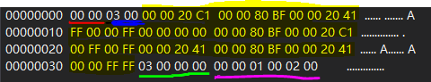
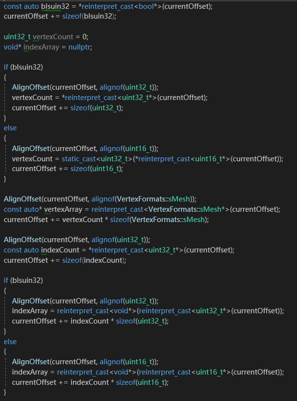

<a href="https://drive.google.com/open?id=1XGNSNnMbK1POR_Kzd6T6R18cjd6L6h4c" class="btn btn-info">Download</a>

## Content

In this assignment, I convert the human-readable file into binary file during building time, then load the binary file during run time.

### Binary File

Here is the screen shot of my binary mesh file (Red: check if index count is uint32_t). The order of four things in the binary file is:

* Vertex count (Blue)
* Vertex array (Yellow)
* Index count (Green)
* Index array (Pink)

<figure>
	
</figure>

The first byte indicates if vertex count is larger than 2^16. There’s a byte right after it for alignment purpose. Vertex count has to be written before vertex array because we need to know how many vertices there are and read exactly the number of vertices. Index count is the same as vertex count. The order of other data doesn’t matter so I choose to write data of vertex block and write data of index block.

The two main advantages of binary file are smaller size to store and quick speed to load into game. We use human-readable formats to store the data when we’re developing game because it’s easy to test and debug the game. Then we convert human-readable files to binary file when build the game since player doesn’t actually need to read the mesh files and binary files are much smaller. When player is playing the game, binary file is quickly loaded (comparing to text file).

The binary file should be different for the different platforms. Since OpenGL and D3D use different winding order, we need to adapt it to each platform before we use it. We can save the time of changing the winding order of meshes in run-time if we already changed it during build time.

### Extract data

Since my program supports uint32_t index count and alignment of data, before read each data block, the pointer has to be aligned. As for reading vertex count and index array, it has to determine if it is uint32_t of uint16_t then read the corresponding data.

<figure>
	
</figure>

<figure>
	
</figure>

### Tables of Time and Size

| Time(s) | Plane | Sphere | Jerrycan|
|:--------|:-------:|:--------:|--------:|
| Human-readable file   | 0.003683   | 0.020755   | 0.781626|
|----
| Binary file   | 0.000281   | 0.001435   | 0.00417|
|=====
{: rules="groups"}

| Size(KB) | Plane | Sphere | Jerrycan|
|:--------|:-------:|:--------:|--------:|
| Human-readable file   | 117   | 532   | 19,056 |
|----
| Binary file   | 8   | 29   | 1,002 |
|=====
{: rules="groups"}

## Controls
Press <kbd>W</kbd><kbd>A</kbd><kbd>S</kbd><kbd>D</kbd> to move the cube. Hold Control and press <kbd>W</kbd><kbd>A</kbd><kbd>S</kbd><kbd>D</kbd> to move plane. Press <kbd>Up</kbd><kbd>Down</kbd><kbd>Left</kbd><kbd>Right</kbd> to move camera.

## Screenshots

Three colorful meshes
<figure>
	
</figure>
