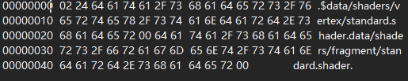
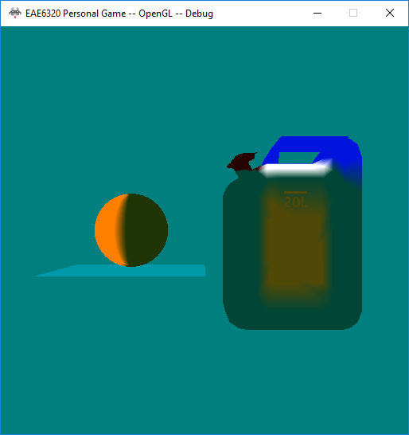

<a href="https://drive.google.com/open?id=1rE8VUelVOgvSLvHUMGjJatLEjA_sPSv2" class="btn btn-info">Download</a>

## Content

During this assignment, I created human-readable file format for developer to add effect quickly, an effect builder to build the human-readable file into binary file, then read the binary file to our game.

### Human-readable file

In the human-readable file, I kept the path of shaders and three Booleans to construct RenderState.

~~~ ruby
return
{
	VertexShader = "Shaders/Vertex/standard.shader",
	FragmentShader = "Shaders/Fragment/standard.shader",
	EnableAlphaTransparency = false,
	EnableDepthBuffering = true,
	EnableDrawBothTriangleSides = false
} 
~~~

### Binary file
The first byte is the bits for RenderState. Then I wrote the length of the first path (including a ‘\0’ in the ending). During run-time, program can get the length of first path and jump x bytes to get the second path. The paths I store are relative to `$(GameInstallDir) `so that we don’t need to cost some time to add the prefix “data/” during run-time. However the storage we need to store the path is larger than storing path relative to `$(GameInstallDir)/data`.

<figure>
	
</figure>

### Extract data

<figure>
	
</figure>

## Controls
Press <kbd>W</kbd><kbd>A</kbd><kbd>S</kbd><kbd>D</kbd> to move the cube. Hold Control and press <kbd>W</kbd><kbd>A</kbd><kbd>S</kbd><kbd>D</kbd> to move plane. Press <kbd>Up</kbd><kbd>Down</kbd><kbd>Left</kbd><kbd>Right</kbd> to move camera.

## Screenshots

<figure>
	
</figure>
