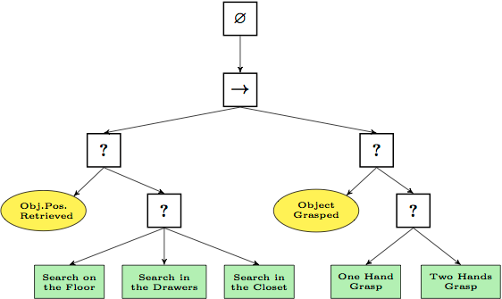
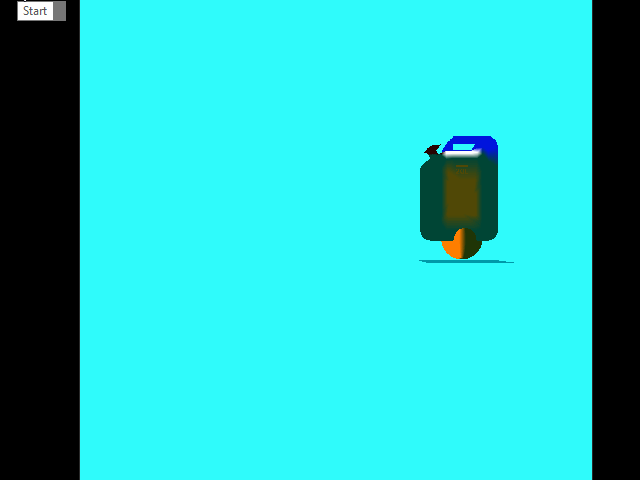

<a href="https://drive.google.com/open?id=1DbCMyw6AtlorX5WWL8wjVJ0FOCqWAyqu" class="btn btn-info">Download</a>

THIS FEATURE WILL HAVE A FRAMEWORK FOR USERS TO SETUP THEIR DATA-DRIVEN BEHAVIOR TREE AND STATE MACHINE.

## Behavior Tree

Behavior tree is composited by lots of nodes, each node has its logic. Some of the nodes (composites) determine which child it choose to be executed, some logic simply execute a task. Each node could have a condition (decorator) which controls program would execute this node. And each node could have a service which runs when this node is being executing.

<figure>
	
</figure>

The basic idea of the framework is:

<figure>
	
</figure>

Developers can create derived class from task, decorator or service to implement their own logic, then use public functions or user data file to link those logic together. The derived class could be reused easily through the data file. Developer will be provided public functions to link nodes, add decorators and services to a node, run behavior tree. The data file should include the class name of nodes, name of nodes, links between two linked nodes.

### Data File Example

~~~ ruby
return
{
    Nodes = 
    {
        {
            ClassName = "SelectorClass",
            Name = "SelectorName",
            Decorators = 
            {
                "DecoratorClass1",
                "DecoratorClass2"
            },
            Services = 
            {
                "ServicesClass1",
                "ServicesClass2"
            },
        },
        {
            ...
        }
        ...
    },
    Links = 
    {
        {"NodeName1", "NodeName2"},
        {"NodeName3", "NodeName4"},
        ...
    }
}
~~~

## Update (11/07)

The framework of behavior tree is finished. I added some tasks and decorators to move game object and check their distance. The example behavior tree will make the sphere chasing jerry can if the distance between them is less than some value.

I plan to implement the data file for the behavior tree and create a structure for the communication of nodes in the behavior tree.

<figure>
	
</figure>

## Update (11/14)

During this week, I designed human-readable file for my behavior tree system, implemented the builder to read human-readable file and convert it to binary file, then load binary file into memory.

### Setup Behavior Tree

1. Set Root
A behavior tree has a unique root node which is the first node to be execute when it runs. To setup the root, use function `void SetRoot(BehaviorTreeNode* ipRoot)`. Root has to be the first node linked to the behavior tree.

2. Link Nodes
	1. Developers can use `void AddChild(BehaviorTreeNode* ipChild)` to link parent and child nodes BehaviorTreeNode_Composite.
	2. Developers can push all the nodes into one std::vector then use `void Link(std::vector<BehaviorTreeNode*>& ipNodes, const std::vector<std::pair<uint16_t, uint16_t>>& ipLinks)` to link all the nodes by their index.
	3. It’s also possible to load links by file. Use `eae6320::cResult LoadLinks(std::vector<BehaviorTreeNode*>& ipNodes, const char* const ipFilePath)` to link nodes by file path.
	Behavior tree data should be as below:
~~~ ruby
return
{
    Links =
    {
        {0, 1},
        {0, 2},
    },
}
~~~

3. Add decorate and service
Use `void AddDecorator(BehaviorTree_Decorator* ipDecorator)` and `void AddService(BehaviorTree_Service* ipService)` to add decorators and services to a node.

4. Execute
Use `void Execute()` in the update function to execute behavior tree each update.

### Setup Behavior Tree

Tasks, composites, decorators and services can be easily implemented by derived from the base class.

1. Task
Derived from BehaviorTree_Task then override the function `void ExcuteTask()`

2. Composite
Derived from BehaviorTreeNode_Composite then override the function `bool Execute()`

3. Decorator
Derived from BehaviorTree_Decorator then override the function `bool Check()`

4. Service
Derived from BehaviorTree_Service then override the function `void Run()`

### Blackboard

Since all the nodes, decorators and services need some way to communicate, I create a Blackboard class for them to get and set values by name and type. It has an enum class BlackboardSelector to specify what kind of type the variable is, which includes boolean, integer, float and vector for now.

### Blackboard Data

The human-readable data file of blackboard data can be describes as below:

~~~ ruby
return
{
    vector = 
    {
        "Name1",
        "Name2"
    },

    bool = 
    {
        "Name3"
    },

    float = 
    {
        "Name4"
    },

    int = 
    {
        "Name5"
    }
}
~~~

### Setup Blackboard

* Use constructor `Blackboard(std::vector<std::pair<BlackboardSelector, std::vector<std::string>>>& selectors, uint16_t inMaxSize)`
* Or Load from file use `eae6320::cResult Load(const char* ipPath, Blackboard*& outBlackboard)`

### Use Blackboard

* Use `T const GetValue(const char* const ipKey)` to get value by name
* Use `void SetValue(const char* const ipKey, const T inData)` to set value by name

Note the value can only be bool, int, float and vector for now. It is not safe if the type of template passed in is not the same as the type of data it stores. The way to get and set value would be changed to make it safer in the next wee

## Screenshots

<figure>
	
</figure>
