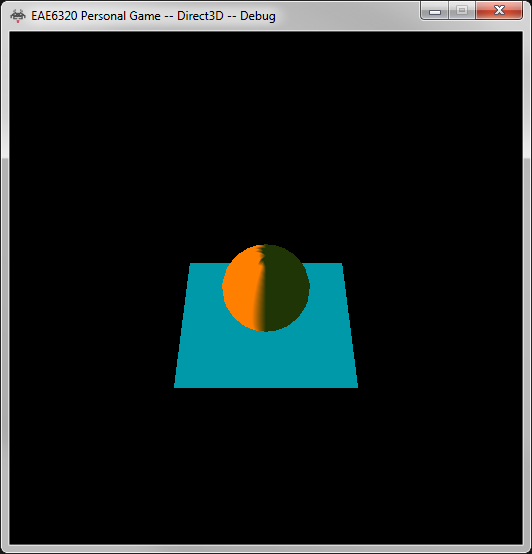
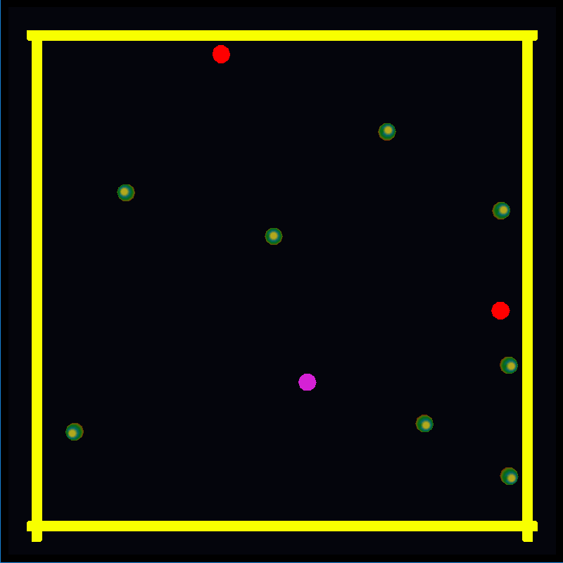

<a href="https://drive.google.com/open?id=1tjfXM3_T7chdX1jVyonCPZeaJGJZub1D" class="btn btn-info">Download</a>

## Game Description

In this game, player controls one unit (with looped color) and other units (with static color) are controlled by AI. All the units have the same ability – dash. Dash increases the move speed of a unit, lasts for 2 seconds and has 5 seconds cooldown. During dash time, a unit changes its effect (red color) and can eat other unit which is not dashing. The unit eaten will respawn at another random position. There’s a boundary in the level which keeps unit from getting out of the scene.

## Engine System

### AI Controller

AI has four different behaviors below which composites its behavior tree:

1. Flee
---
If the unit is not dashing and there’s other unit dashing around it, it would move to opposite direction from the dashing unit.

2. Chase
---
If the unit can dash (last dashing was 5 or more seconds ago) and there’s other unit which is not dashing around it, it would dash and move toward the other unit.

3. Wander
---
If the unit is not fleeing or chasing, it will choose a random direction every 5 seconds and move toward it.

4. Reach Boundary
---
If the unit collides with boundary, it will move align to boundary.

### Behavior Tree Visualization

<figure>
	
</figure>

When I actually used my behavior tree to create the AI controller, I found every unit needs a behavior tree even though the behavior trees are same. It would use a lot of unnecessary memory to create the duplications of a same behavior tree. So I changed my interface to use the tree. In the past, user had to pass an object and blackboard to the constructor of behavior tree, which means a tree stores these values inside its instance and controls only one object. Now user needs to pass the object and blackboard to the execute function which is executed in update function so that user can pass different values to the same behavior tree.
The basic idea of the framework is:

### [Audio System (By Shantanu Pandey)](http://www.codenamepandey.com/audioengine)

There’s a background music. If unit is eaten, plays a bubble sfx. The interface of Audio System is pretty intuitive and easy to use. I’d like to suggest to add some comment to explain some parameters of the interface. For instance, there’s an interface `void SetVolume (float value)` that I have no idea what the range of value should be. It would be better if there’s a comment saying the range should be [0, 1].

## Controls
<kbd>W</kbd><kbd>S</kbd><kbd>A</kbd><kbd>D</kbd> to move player unit
---
<kbd>SPACE</kbd> to dash
---
<kbd>ESCAPE</kbd> to exit game

## Game Record

<figure>
	
</figure>

## Discussion

I’ve learned a lot in this class which I think are all important or at least helpful and heuristic to me. I learned how to write platform independent code and provide clear interface to other users, which is pretty important when we’re working in a big team. Human-readable file and the conversion from human-readable file to binary file are interested and helpful. Now I’m able to understand how data-driven design works and why it is helpful in game development. 
I was expecting a specific assignment to introduce the whole solution, because we’re not familiar with some of the project like concurrency. It would be awesome to have an overview of the solution and understand it systematically.
