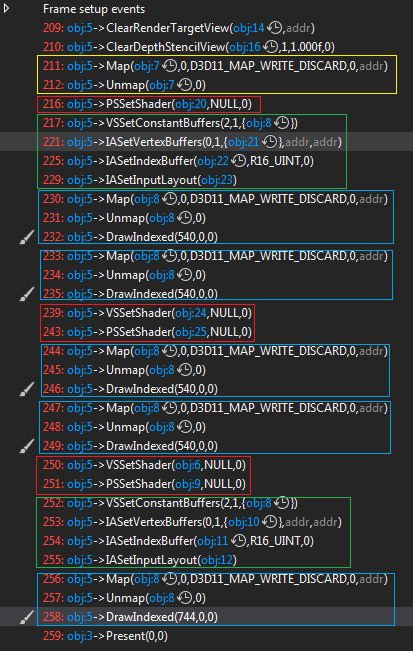

 
 
<a href="" class="btn btn-info">Download</a>

## Render Command
Performance in Game Engine is an important thing that a game engineer has to focus on. In our game engine, we use array to store mesh and effect pairs and draw them pair by pair. It is an expensive operation to bind effect. For now we bind a effect before drawing a mesh but we don’t check if the effect is same as the last one. If we draw all the meshes which have a same effect together, we don’t bind same effect more than once. We can also draw the same meshes together to improve more performance but in this case we need to sort effect-mesh twice. If we want to reduce unnecessary steps even more, we need to sort more times and it is not worthy to do that. 

We can encode effect, mesh, depth and some other information we need to one single uint64_t (**Render Command**) then we can sort it only one time. Then we decode the render command and get information we need to draw meshes. We already get handle of mesh and effect, each handle has an unique index which can be used to get the corresponding handle. We could store the handle index into our render command. 

Effect handle index must to be stored in the most significant bits (**64 - 49**) since binding effect is the most expensive operation. Then the mesh handle index (**48 - 33**), depth (**32 – 17**) and index of constant buffer per drawcall (**16-1**).

## Results


    ../assets/img/blog/RealtimeRendering/Assignment01/1.gif




    ../assets/img/blog/RealtimeRendering/Assignment01/2.gif


    
## More Optimization

After doing things above, we still have a lot of unnecessary calls through GPU capture, such as render state binding and shader binding. In this case, I use handle to store render state and a uint8_t has only on render state. The last bound shader and render state was store somewhere in graphics. Before we bind a shader or render state, we compare the new one to the last one. It only binds if they are not same. It helps reduce the number of binding shaders and render state.

## GPU Capture

<figure>
	
</figure>

There are 5 draw calls (in blue, two red spheres, two colored spheres, one floor)

There are 3 effect changes (in red, red effect for sphere, colored effect for sphere and standard effect for floor) 

There two related to vertex buffer and index buffer (in green). I used two different meshes (floor and sphere) and cached last mesh so it won’t bind mesh multiple times.

The per-frame data is in gold.

