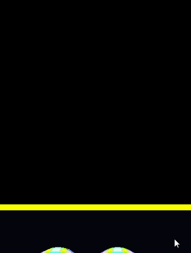
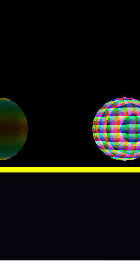
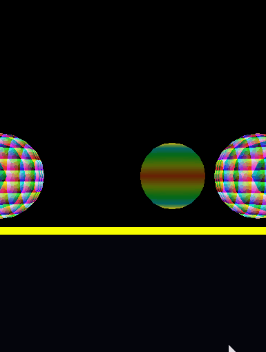

 
## EFFECTS

### Based on Local Vertex Position

The color of every fragment of this pattern is calculate by local vertex position, which is not affected by world position or camera position. To approach this pattern, the local position of each vertex is passed to fragment shader from vertex shader. Fragment shader does some calculation on vertex position, which basically uses sin and round function to map the vertex position into [0,1].

### Based on Local Vertex Position

The color of every fragment of this pattern is calculate by only world vertex position. The calculation is the same as above. The only difference is vertex shader passes world position of each vertex rather than local position.

<figure>
	
</figure>

### Scale Object Over Time

The object using this effect is scaled from 0 (nothing) to 1(original size). In vertex shader, a scale matrix is created by sin and simulation time. We get vertex position in world by `vertexPosition_world = g_transform_localToWorld * scaleMatrix * position_local`.
scaleMatrix can be simplied to a scaleVector: [value, value, value, 1]. Vertex position in world is `g_transform_localToWorld * (scaleMatrix * position_local)`

<figure>
	
</figure>

### Based on Camera Distance

The color of every fragment of this pattern is affected by the distance between camera and the fragment. In vertex shader, I get the vertex position in camera world, the pass its length to fragment shader. In fragment shader, if the distance is smaller than a threshold, the alpha value of this fragment is 0, otherwise the alpha value is mapped to [0,1]. The larger the distance is, the smaller the alpha value is.

<figure>
	
</figure>
