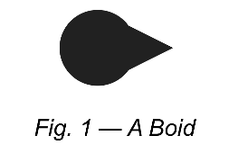

 
<a href="https://drive.google.com/open?id=1vaHBPWQoczgMFuGFtwRTXcqjo8s1TOOX" class="btn btn-info">Download</a> Project and article in PDF Format

## Introduction

This is the summarization of Assignment 1 in A.I. For Games, whose purpose is to explore and analyze various movement algorithms.

## Implementation

### Theory

The core theory of character movement is: a movement algorithm takes a character and some game environment as arguments, does some calculation with these arguments, then output a movement request back to character. Then the character changes its movement based on the movement request.

### Kinematic Data Structure

“Kinematic” is used to present the movement of a character, whose data structure is:

~~~ c++
Kinematic
{ 
	position;       // 2D vector
	orientation;    // float (in radian)
	velocity;       // 2D vector
	rotation;       // float
}
~~~

### Boid

To visualize character, a simple circle and triangle are drawn on the screen, which is named “Boid". The center of the circle is the position of its Kinematic, the direction of the triangle is the orientation of its Kinematic.

<figure>
	
</figure>

### Kinematic Steering and Dynamic Steering

In general, movement algorithms are divided into two categories: Kinematic Steering and Dynamic Steering. 

The output of kinematic steering algorithms is kinematic steering output:

~~~ c++
Kinematic Steering Output
{
	Velocity,		// 2D vector
	Rotation		// float (angular speed)
}
~~~

If kinematic steering is applied, the character updates its kinematic by applying the new velocity and rotation directly.

The output of dynamic steering algorithms is dynamic steering output:

~~~ c++
Dynamic Steering Output
{
	Linear,		// 2D vector (acceleration)
	Angular		// float (Angular acceleration)
}
~~~

If dynamic steering is applied, the character updates its kinematic by applying the new acceleration and angular acceleration to the old velocity and rotation.

In most of this assignment, we focused on dynamic steering.

## Kinematic Motion

The kinematic motion was the first step to explore the movement algorithm. Boid traveled around the edge of the window using kinematic steering. 


    ../assets/img/blog/AIForGames/MovementAlgorithms/basic-motion.gif



## Seek Steering Behaviors

### Seek 

Seek steering behavior is to make a boid go to a target position. In kinematic seek steering, max speed is returned, while in dynamic seek steering, max acceleration is returned.

### Arrive

A boid cannot stop when it reaches the target if only seek steering is applied, so arrive steering behavior is introduced. In kinematic arrive steering, if the distance between boid and target is smaller than some value, it stops immediately. In dynamic arrive steering, there are two different radiuses. If the distance between boid and target is smaller than a slow radius, it slows its speed by friction. If the distance is smaller than the target radius, it stops immediately. Otherwise, the boid is not affected by arriving steering. 

### Results


    ../assets/img/blog/AIForGames/MovementAlgorithms/seek-kinematic-arrive.gif




    ../assets/img/blog/AIForGames/MovementAlgorithms/seek-dynamic-arrive.gif



From the results, we could conclude that the two boids both started from 0 speed and speeded up smoothly until a max speed was reached. The difference between them was that in seek-dynamic-arrive, boid slowed down before it reaches the target, while in kinematic-arrive, boid suddenly stopped one it reaches a target radius. It was obvious that the dynamic arrive looked better than the kinematic arrive because that's what happens in real life. Imagine a person who’s running toward a target, he/she has to control and decrease their speed when near the target so he/she can stop at the correct position safely. If a person stops suddenly, he/she would probably fall down into the ground.

There was an interesting result I have found when I was testing the algorithm. In seek-kinematic-arrive, if the target position was close to boid, boid never had a chance to reach the target. It kept spinning around the target. My explanation is that the algorithm always returned a max acceleration, which was a constant value during the simulation, it became a centripetal force that only changed the direction of velocity rather than speed, making boid keep spinning and never slowing down.


    ../assets/img/blog/AIForGames/MovementAlgorithms/seek-kinematic-arrive-circle.gif



## Wander Steering Behaviors

### Align 

In dynamic steering, boid generally faces to the direction of velocity. In some situations, dynamic align steering is used. The basic algorithm is similar to dynamic arrive, in which velocity is replaced by a rotation. 

### Wander

Wander steering is used to make a boid move randomly. In kinematic wander steering, we simply add a random binomial value to the orientation of the boid kinematic. In dynamic wander steering, a random target in front of boid is calculated by distance and radius. Boid seeks the random target and dynamic align to its new velocity. 

### Results


    ../assets/img/blog/AIForGames/MovementAlgorithms/kinematic-wander.gif




    ../assets/img/blog/AIForGames/MovementAlgorithms/dynamic-wander-facewhereyougo.gif




    ../assets/img/blog/AIForGames/MovementAlgorithms/dynamic-wander-facetarget.gif



From what was showed on the screen, the dynamic-wander looked much better than the kinematic-wander. There are two reasons for the difference:

1.	In kinematic-wander, the orientation was changed directly to boid. If the difference between the orientation of the two frames was totally unpredictable. If boid rotated 1 degree at the first frame, rotated -5 degrees at the second frame, rotated 5 degrees at the third frame, the movement will look jerky because of the big difference. 
2.	Even though we used a random binomial function to make the change of orientation as close as 0, we can not make sure that the random change will never be 1. We used random * maxRotation to calculate the real rotation, if maxRotation is too small, wander steering is not obvious because most of the rotation is too small. If maxRotation is too large, once the random generator rolls a higher value, boid would suddenly go to another direction which would be unrealistic. 

Those two problems were both solved in dynamic wander. Once the boid chose a random target, a boid used dynamic seek to reach it. Since dynamic seek returned acceleration and angular acceleration, the velocity and rotation would not change dramatically, which solved the first problem. Because the random target a boid chose was always inside a cone in front of itself, boid won’t go backward immediately. I also made a small tweak in dynamic align here. The targetAngleThreshold was set to 0 because, in wander steering, we don't want the boid to align to the target exactly. If it was set to 0, boid would never stop aligning, sometimes it aligned more clockwise, another time it aligned more anticlockwise, which the randomness we need. 

I have tried two ways to change the orientation of dynamic wander, face to target and face to where you go. The results of the two algorithms both looked good, similar to each other. The difference I’ve found was in face-to-target, the targetAngleThreshold could not be 0, otherwise, boid would move as “8” shape, which looked pretty interesting. 

In conclusion, kinematic wander is more like an unordered wander, while dynamic wander is traveling along the orientation with some wander behaviors.
I used two different ways to deal with the boundary. In kinematic wander, boid was directly bounced back. But in dynamic wander, boid was moved to the other side of the window. I was trying to use bouncy behavior in dynamic wander. Once boid reached a boundary, its velocity was set to the opposite direction. It turned out it was likely to go toward boundaries again and again. In my opinion, since dynamic wander doesn’t change movement dramatically, it also makes the behavior of turning around harder.

## Flocking Steering Behaviors

Flocking steering is an algorithm to simulate a group of boid. There are three important factors in flocking steering: avoiding other boids, matching the velocity of the flock, intending toward the center of the flock. To avoid other boids, a boid needs to calculate an acceleration toward the opposite direction of each boids, add them together, clamp it into [0, maxAcceleration]. To match the velocity of the flock, a boid rotates toward the average velocity of the flock if there's no leader, or it seeks leader if there is one. To move toward the center of the flock, a boid seeks the center of mass of each boid. 

### Results


    ../assets/img/blog/AIForGames/MovementAlgorithms/flocking.gif




    ../assets/img/blog/AIForGames/MovementAlgorithms/flocking-small.gif



Flocking is relatively a complex steering behavior. To make a flocking behavior look good, there were at least four value to tweak. Flocking is a combined steering behavior, in which every behavior is combined linearly, thus each behavior has its steering weight. In my flocking steering, the three weight are separation weight, seek leader weight and seek center weight. The relation between these three values are: separation weight > seek leader weight > seek center weight. If separation weight is small, boids would overlap and collide with each other, which looked pretty chaotic. If leader weight is small, it would take more time for a boid to chase a leader if the leader changes its direction. To make the result acceptable, I also limited the max speed of boid to 80 percent of the max speed of the leader, so that leader usually moved in front of the flock. 

K value in separation behavior is also important. The larger the K is, the more separated the flock is. In my implementation, the max acceleration of boid is 100, my K needed to be around 10000 to get a good result. If K is smaller than 100, we cannot even observe any effect of separation.

The results were getting worse when the number of boids was getting larger. It happened because of the separation. Each boid needed to avoid every other boids, when it got more crowded, it was more likely for a boid to have a lot of boids around it, and the possibility of a boid colliding with other boid was getting bigger as well.

Another result I’ve found is that when leader moved into the flock, almost every boid near the leader would stop and wait for the leader to move away. That was because the implementation of my dynamic seek steering changed the velocity of boid to 0 directly when boid was inside a radius of the target position. However, boid in flocking steering should not stop moving. It’s intuitive that they are supposed to turn around to avoid leader. It might be a way to solve this problem that writing a new steering behavior so that boid would chase the target if the distance is large and avoid the target if the distance is small.

