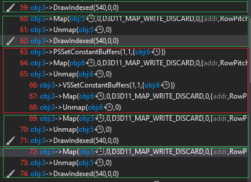
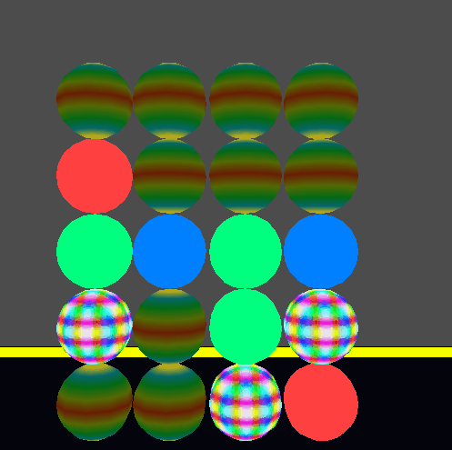
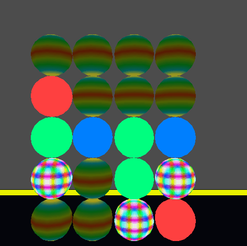

<a href="https://drive.google.com/open?id=1qJV4BOca9NfmFYgBDdbi7CPb12qi5eua" class="btn btn-info">Download</a>

## Material

What consists of a material is an effect and some other constant data used in shaders of the effect. As same as effect, we're going to create a human-readable material file, then convert it into binary file during build time, load the binary file to our game when playing it.

### human-readable file

We only have one kind of constant data for now: **color**, which is a float[4]. Every constant data in material should be optional, having a default value, so that content creators don't need to pay attention to what they don't care. In case a new kind of constant data is needed to be added, it won't mess with the old data.

Example of human-readable file
~~~ c++
return
{
	Effect = "Effects/standard.effect",
	Color = 
	{
		0.1, 0.1, 1, 1
	}
}
~~~

### Sending Data to Graphics

After having materials, we send the pairs of material and mesh to graphics instead of the pairs of effect and graphics.

Normally, the constant data is submitted on game thread and stored on graphics thread if we want to change it at runtime. However I don't know how to do it effectively, so for now I changed constant data on game thread then rendered it on graphics thread which is not correct.
> Please tell me how to do this, JP!

### Sort New Render Command

New render command is sorted by effect, material, mesh depth and transformation.

<figure>
	
</figure>

### GPU Capture

<figure>
	
</figure>

There are 4 draw calls (in green), the first two draw calls use a same material, the last two draw calls use a same material. The commands between them (in red) change material. Since they have different constant data, the constant buffer is reset between the two materials. I reset constant data for both vertex shader and fragment shader because they both might need it. Maybe there's a way to optimize this, only set constant buffer to a specific shader when it's needed? 

### Change Constant Data at Runtime

The six spheres and my floor all use standard material, the constant data of standard material is incremented or decremented when a key is pressed.

<figure>
	
</figure>

### Duplicate Material

To have a duplication of a material, the duplicated material needs to have a copy of the effect handle in the original material, increments its reference count, and copy the constant data to its own constant data.

The four spheres in the top use a duplication of standard material, the constant data of the duplication is changed without affecting the original material.

<figure>
	
</figure>

### Control

Press <kbd>Up</kbd><kbd>Down</kbd><kbd>Left</kbd><kbd>Right</kbd> to move move up/down/left/right.

Press <kbd>W</kbd><kbd>S</kbd> to move forward and backward.

Press <kbd>Q</kbd><kbd>E</kbd> to rotate anticlockwise and clockwise.

