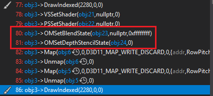

## Independent and Dependent Draw Call
Independent draw call is the draw call which doesn't depend on what has been drawn on screen, like the draw calls we used before. Dependent draw call depends on what's already there on screen. The most common dependent draw call is transparent effect.
To draw dependent draw call correctly, independent draw call needs to be drawn before dependent draw call. Then dependent draw call is drawn from far to near. 

### Render Command
We want to draw independent first then draw dependent by depth first. The render command for dependent draw call is (1, -depth(convert to [0, 255]), effect, material, mesh, transformation) from most significant bits to least significant bits. The render command for independent draw call is (0, effect, material, mesh, depth, transformation).

### Result
<figure>
	
</figure>

## Optimize GPU call
In our cRenderState class, we actually bind three different GPU state: Blend State, Depth Stencil State, RSState. We can cache the last render state we bind, then compare its every state with the current one, only bind a new state when they are different.

### Disable Depth Writing
We need to a depth test when drawing a transparent object because the fragment behind a independent fragment should be rejected.
We don't need to do a depth writing when drawing a transparent object because every transparent fragment in front of independent fragment should be drawn and blended.

Only Blend State and Depth Stencil State

<figure>
	
</figure>

## Other Blend Modes
Direct 3D provides a way to customize the blending calculation. The calculation is:

`result =  (Src * SrcBlend) BlendOp (Dest * DestBlend)`,

`resultAlpha =  (SrcAlpha * SrcBlendAlpha) BlendOpAlpha (DestAlpha * DestBlendAlpha)`

For the most common blending calculation in games, the equation is:

`result = ( source * source.a ) + ( destination * ( 1 - source.a ) )`

I've added two different custom blend mode: 
* Additive: result =  source +  destination
* Multiply: result = ( source * source.a ) + ( destination * destination.a )


    ../assets/img/blog/RealtimeRendering/Assignment05/Additive.png
    ../assets/img/blog/RealtimeRendering/Assignment05/Multiply.png

