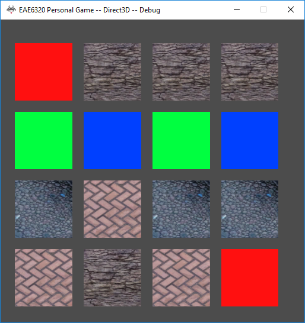

<a href="https://drive.google.com/open?id=1DOP_xZOTyTggknRBsX3SEYobWqDURNOI" class="btn btn-info">Download</a>

### Add texture into build pipeline
Three steps needs to be done before we can render texture in our scene.
1. Add texture builder project and add new asset type in our build library.
2. Add UV to our vertex format and input layout.
3. Add definition functionality of texture to our shader (Add them in shader.inc so that every shader can use texture). In D3D, there are different register type:
	> b : constant buffer
	t : textrue buffer
	s : sampler state
	

### Bind and render a texture
* Bind sampler state by register
* Bind texture by register

### Material with texture
Content creator can define the path, filtering, and edge behvior of a texture. If nothing is defined, the material will build a default texture with a default sampler state. Every texture has its own sampler state and it's built into texture binary.

~~~ c++
return
{
	Effect = "Effects/Standard.effect",
	Color = 
	{
		1, 1, 1, 1
	},
	DiffuseTexture =
	{
		Path = "Textures/1.png",
		EnableFiltering = true,
		EdgeBehaviorU = "Tile",
		EdgeBehaviorV = "Tile"
	} 
}
~~~

Texture can be defined more generally. We could have more than one texture in the furture, so texture should be defined inside a table (list) with a texture type to indicate its usage.
~~~c++
...
Textures = 
{
	{
		Path = "Textures/1.png",
		EnableFiltering = true,
		EdgeBehaviorU = "Tile",
		EdgeBehaviorV = "Tile",
		Type = "Diffuse"
	},
	{
		...
	}
}
...
~~~
### Result

<figure>
	
</figure>

### Control

Press <kbd>Up</kbd><kbd>Down</kbd><kbd>Left</kbd><kbd>Right</kbd> to move move up/down/left/right.

Press <kbd>W</kbd><kbd>S</kbd> to move forward and backward.

Press <kbd>Q</kbd><kbd>E</kbd> to rotate anticlockwise and clockwise.

