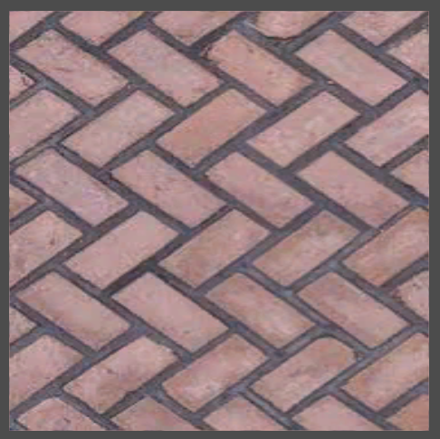
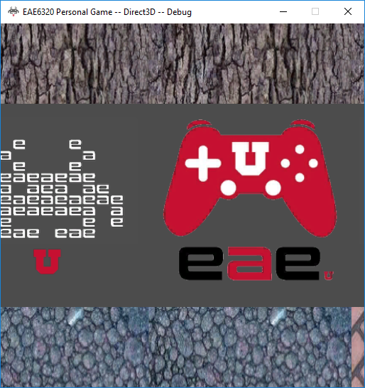

## Filtering
Texture is just an array of data which contains color information. The number of texels and the number pixels are rarely same, so different ways to calculate color of a pixel from texture will lead to different color results. 

The default behavior of GPU without filtering is to get the color of nearest neighbor texel by UV. If the camera is really close to a texture, each texel overlaps with a block of pixel, having a clear edge with other adjacent texels.

If we enable a bilinear filtering, GPU will find several texels around the position in texture coordinate and get the average color of those texel colors. It has a smoother and more realistic result when camera is really close to texture.


    ../assets/img/blog/RealtimeRendering/Assignment07/disable.png
    ../assets/img/blog/RealtimeRendering/Assignment07/enable.png



## MIP Maps
MIP maps are precomputed sequence images of an original image, each of them has a lower resolution of the original image. Using MIP maps could improve runtime performance by reducing sampler number. It also reduces aliasing at large distance.

<figure>
Highest level of MIP map
	
</figure>

In the first image, MIP maps are enabled, everything looks normal. In the second image, MIP maps are disabled, we can notice there is distortion in the face-up texture. Because GPU maps the position in image coordinate to texture coordinate, if we render a large texture to a small block of pixels, two adjacent pixels might be mapped to two positions far from each other, which might cause aliasing. 


    ../assets/img/blog/RealtimeRendering/Assignment07/MIPenabled.png
    ../assets/img/blog/RealtimeRendering/Assignment07/MIPdisabled.png



The size of MIP maps are divided by 2 each time. If the original texture is 256 x 256, its MIP maps contains 8 images:
128 x 128, ,64 x 64, 32 x 32, 16 x 16, 8 x 8, 4 x 4, 2 x 2, 1 x 1.


    ../assets/img/blog/RealtimeRendering/Assignment07/mip0.png
    ../assets/img/blog/RealtimeRendering/Assignment07/mip1.png
    ../assets/img/blog/RealtimeRendering/Assignment07/mip2.png
    ../assets/img/blog/RealtimeRendering/Assignment07/mip3.png
    ../assets/img/blog/RealtimeRendering/Assignment07/mip4.png
    ../assets/img/blog/RealtimeRendering/Assignment07/mip5.png



## Use Texture Alpha Channel

<figure>
Use only a quad with a transparent texture to display more detail
	
</figure>

We can set a threshold of alpha value and discard those pixels whose alpha value are smaller than the threshold. In this way, each pixel is independent, showing more detail, thus we don't need to enable alpha blending. 


    ../assets/img/blog/RealtimeRendering/Assignment07/u.png
    ../assets/img/blog/RealtimeRendering/Assignment07/alphau.png



## More Effect with Animated Texture

### Scrolling Texture
<figure>
	
</figure>

We can change texture coordinate in our shader to make texture move. In order to achieve the behavior above, I add some value to the x texcoord in vertex shader and pass it to fragment shader. The sampler state has to be set as clamp in U axis as well. The left edge and right edge of this texture have to be seamless. 

We can change texture coordinate in vertex shader or fragment shader. Both of them work well and have same effect and quality, but it's cheaper in vertex shader since vertex shader is called much less than fragment shader.

### Pulse Texture
<figure>
	
</figure>

The UV is scaled based on sin(time), its pivot is set to be the center of texture (0.5, 0.5).
