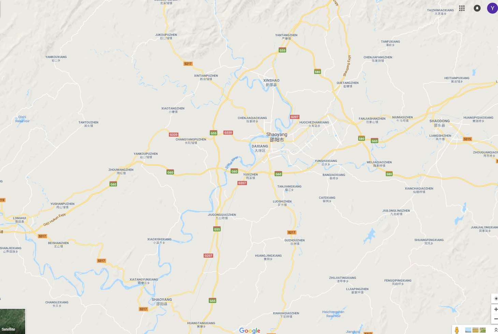

 
<a href="https://drive.google.com/open?id=1gBHD2iviDbORJ3qZLjkhpoN3i3K0KEen" class="btn btn-info">Download Project</a>

## Introduction

The purpose of this assignment is to use pathfinding algorithms to try to find a connective path from our boid to another location in a map and move our boid to that location. To achieve the goal, first, we need to present our world to graph by some data structures, which is called quantification. Second, we need to use the algorithm and the data structure we have to calculate a path. Third, transfer the path we find from graph space to world space, which is called localization. Last, move our boid to the new location, following the path we find, delegating to the steering behavior we did by movement algorithms.

### Data Structure of Graph
A weighted directional graph is used as the presentation of our map. 

~~~ c++
class Graph {
    Edge	edges[];	        // stores every edges in this graph
    NodeRecord	nodeRecords[]; 	// stores every node records in one path finding
    int 	nodeIndices[];		// stores indices of every node
};

class Edge
{
	int sourceIndex;		// index of source node
	int destIndex;		// index of destination node
	float cost;	                // the cost of this edge
};

class NodeRecord
{
	int nodeIndices;		// index of node
	Edge incomingEdge;	        // incoming edge
	float costSoFar;		// the cost from source node to recorded node
	float estimatedTotal;	// cost so far + heuristic cost from recorded node to destination node
};

class Node
{
	float x, y;		        // location of node
};

~~~

### Mannually Designed Map
To test the correction of my implementation, I designed my first graph from a map around my hometown. The original screenshot of my map is:

<figure>
	
</figure>

There are two different kinds of roads on the map. The cost of time of white thin roads is 1.5 times the cost of yellow thick roads. Some cities are represented as nodes with 2D coordinates as their location. The simplified map is:
<figure>
	
</figure>

I measured the rough length of each road and calculated its cost based on type and length. The visualization of the final graph is:
<figure>
	
</figure>

### Random Generated Map
To test the performance of my implementation, I created a second graph by generating a very huge graph randomly. I preset the width and height of the map, then the algorithm picks n random locations as nodes, picks a random number between n and 3n pairs in these nodes and connects them as edges. The cost of each edge is a random number between the distance of two nodes and 2 times the distance. There might not be a valid path between two nodes by generating a graph in a way like this.

## Pathfinding Algorithms
The very straightforward solution to find a path is to traverse every node the edges linked to from source node to destination node and get the path with the smallest cost. However, the time complexity of this kind of algorithm is unacceptable. Instead of calculating every path, we can use a priority queue to store the smallest cost from the source node to the current node and traverse the node with the smallest cost first. Once we find the source node, the current path is proved to be the shortest one. This is called Dijkstra algorithm. Furthermore, we can add a heuristic cost from current node to destination node to the cost so far from source node to current node as their total cost, which is used as the priority in the queue. This is called A* algorithm. The choice of how to calculate heuristic cost is important in A* algorithm. The heuristic function has to be underestimated to make sure A* works better than Dijstra. The common heuristic functions are:

* Manhattan distance: distance = abs(x1 – x2) + abs(y1 – y2)
* Euclidean distance: distance = sqrt((x1 *x1 – x2 * x2) + (y1 * y1 – y2 * y2))
* Cluster distance
* Any set of value given by designers
I also use random value in my heuristic function.

 Because the nodes of my graph have location, Manhattan distance and Euclidean distance are always underestimated and admissible, while a random number is not guaranteed to be underestimated and admissible.

### Result

| Average Time (100 times) | A* Manhattan | A* Euclidean | A* Random | Dijkstra |
| --- | --- | --- | --- | --- |
|Small map (22 nodes, 37 edges) | 8.89 μs | 8.84 μs | 19.82 μs | 8.28 μs |
| Large Map (2000 nodes, about 6000 edges) | 79.41 ms | 109.25 ms | 221.18 ms | 216.65 ms |

| Average Number of Nodes Visited (100 times) | A* Manhattan | A* Euclidean | A* Random | Dijkstra |
| --- | --- | --- | --- | --- |
|Small map (22 nodes, 37 edges) | 9.45 | 9.78 | 16.49 | 14.93 |
| Large Map (2000 nodes, about 6000 edges) | 1281.71 | 1490.16 | 1819.64 | 1788.65 |

| Memory Usage in Heap | A* Manhattan | A* Euclidean | A* Random | Dijkstra |
| --- | --- | --- | --- | --- |
| Large Map (2000 nodes, about 6000 edges) | 10282 KB | 10290 KB | 10390 KB | 1035 KB |

According to the result table, we can conclude that A* algorithms with an underestimated and admissible heuristic such as Manhattan and Euclidean distance have better results in terms of both time and memory complexity. However, an overestimated heuristic would cause worse results than Dijstra in both time and memory usage. The random function I use to test is to choose a random number in a very large range, which makes most of the cost overestimated. In this case, the path following algorithm might find the wrong direction at first, then turn back to the right direction, which decreases time and memory performance greatly.

## Division Scheme
All the content we discussed above is about pathfinding algorithms. We are going to discuss the methods of quantification and localization, which is part of division scheme. 

Division Scheme is a way to convert a world space into linked regions. It consists of three different parts:
1.	A method to generate the graph
2.	Quantification / localization methods
3.	Evaluation of validity. A division scheme is validating if all points in the connected regions can be reached from each other.

There are three typical division schemes:
### Dirichlet division
It’s a semi-automated division scheme, in which a designer assigns some characteristic points to the real map, then the algorithm provides the partition of maps according to the points. The qualification of Dirichlet division is to find a characteristic point closest to world position, the localization is to find the position of the characteristic point in world space.

### Tile
Tile is an automated method where a designer defines the width/height of a tile and "overlay" on top of the world space. Its qualification method is to map each location in world space to its closest tile in graph space, the localization method is to get the center of tile in world space. The tile is validating only if all obstacles can fit into tiles perfectly. 

### Navmesh
Navmesh is an automated method in which algorithm converts the geometry in world space into a bunch of connected triangles. It could have manual variation such as accuracy.

The division scheme used in my project is Tile. It's easy to generate a graph from a map by tile, and it saves time to get edges of nodes because every node is connected to its adjacent nodes (with different cost). I use a grey image as my map in world space, the black area is an obstacle that cannot be pass by boid. To convert an image to a graph, I made some changes to the file qualification, where each node has its own cost instead of each edge. If the number of pixels that have less brightness than 0.5 (0 to 1) is larger than the number of pixels total in a tile, this tile is blocked and its cost is set to be larger than a max cost. In my algorithm, if the cost of tile is larger than the max cost, then the edge to this node is blocked and will be discarded. 

### Data Structure of Grid

~~~ c++
class Grid
{
	float map[][]; 		        // 2d array of nodes
	int width, height;	        // width and height of world map
	int gridSize;		        // size of grid
	int gridWidth, gridHeight;	// number of grids horizontally and vertically
	GridRecord	records[];	// record of each grid
};

class GridRecord
{
	int nodeIndex;		// index of recorded node
	Direction direction;	// chosen direction of four directions
	float costSoFar;	// cost so far from source node to recorded node
	float estimatedTotal;	// cost so far plus heuristic cost from recorded node to destination node
};
~~~

After qualification and implementing algorithms, the boid needs to move across the world along the path we’ve found. In the beginning, I stored each adjacent node as my path structure and made my boid seek to next node if it reached the current node. It turned out the boid would not follow the path exactly as I expected, because the distance of each node was too small and I used dynamic seek and arrive which made boid switch between start and stop very quickly. Then I changed the way to present the path by storing corner nodes rather than every node. However, when my boid was trying to turn around the corner, it always turned in a big curve, which might cause it to collide with the wall. I realized that the acceleration of the boid is too small to make it turn quickly, so, in the end, the acceleration of my boid is set to be relatively large to get a better solution.

The map in the project can be any image with a white background since the graph is generated based on the brightness (how white the pixel is). By clicking on any pixel in the map, boid would find the best path to that location and follow the path if there is a valid one.

<figure>
	
</figure>

