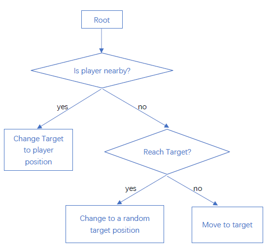
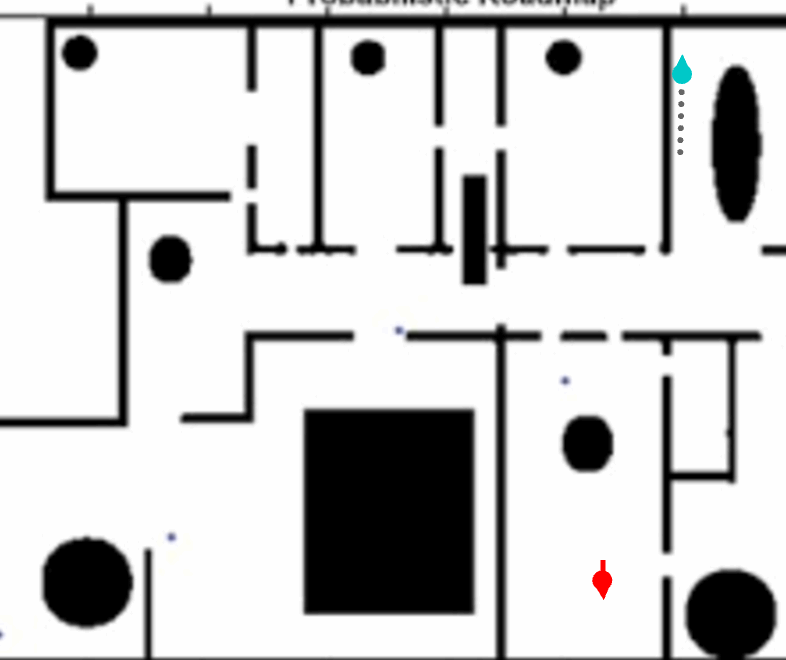
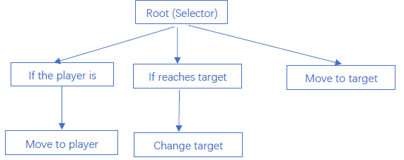
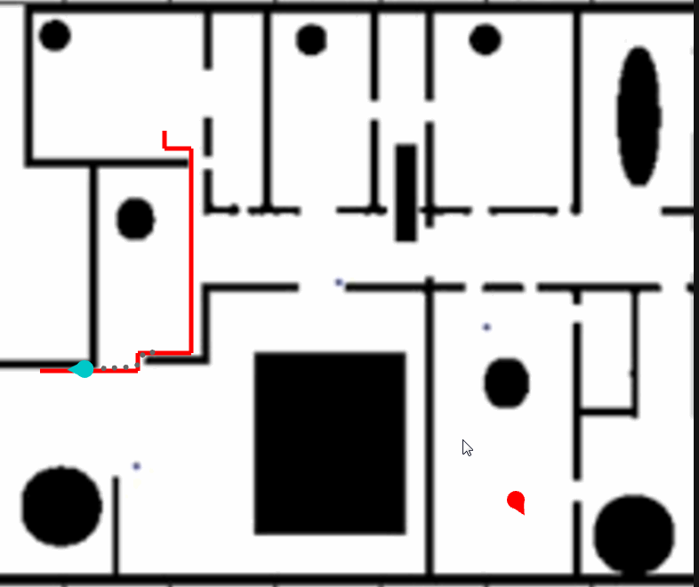
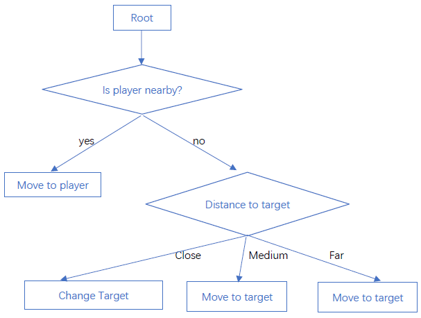
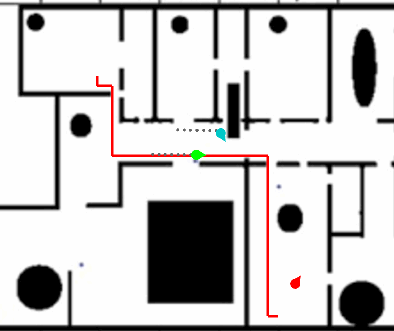

 
<a href="https://drive.google.com/open?id=1ncGXxDThx-1ANO--aYWwI8o7rhEMQ624" class="btn btn-info">Download Project</a>

## Decision making
In this assignment, we're using a decision tree and behavior tree to control the behavior of each character, making smarter characters, reacting to the environment. In addition, we’re going to use decision learning algorithms to create a decision tree from the character controlled by behavior tree and compare the performance and behaviors between generated decision tree and original behavior tree.

### Action manager
Decision-making algorithms only decide what kind of action a character is going to use, it doesn’t determine if a character can perform this action successfully. Decision making is like how people think in their minds, while the execution of an action is like how people move according to this decision. However, a decided action cannot always be executed if there’s always an action being executed. For example, a character can’t move to another position if it is jumping in the air. Thus, we need an action manager to manage how each action works separately and together. 

The class action is an abstract class which has a virtual function which each derived class needs to implement its owner execution logic. It also has two important float numbers to measure its expire time in the waiting queue and execution time. It also could have a priority to sort its waiting order.

~~~ c++
class Action
{
	float mExpireTime = 10.0f;
	float mExecuteTime = 3.0f;
	uint8_t mPriority = 0;
};
~~~

Once the action manager receives an action from the decision-making algorithm, it pushes it into the waiting queue. Each time the action manager runs, it executes the current action or pops out a waiting action from the waiting queue if there’s nothing being executed.

## Decision Tree
Decision Tree is basically a tree structure that composites of many nodes which controls how to get through from the root node to the leaf node. There are two different types of nodes in decision tree: Decision Node and Action Node. Decision Node has more than 1 children, deciding which child node could be executed based on the logic inside it. Action Node can only be a leaf node without any child node, containing the action to be executed in this frame.  

Decision node needs to get information from the environment such as player position, character position, target position and make a decision from that information. In my implementation, I create a context class with all the information a decision node needs and pass it to the decision tree every frame. For now, it only has an owner boid who executes this decision tree because enough information is already stored inside boid class. We can easily add more information to the context class and pass it through in the future, such as map, obstacle, rooms.

~~~ c++
class DecisionNode
{
public:
	virtual std::shared_ptr<Action> GetAction(const Context* const ipContext)  override
	{
		uint8_t index = MakeDecision(ipContext);
		if (index < 0 || index >= mChildren.size())
			assert(false);
		return mChildren[index]->GetAction(ipContext);
	}

	virtual uint8_t MakeDecision(const Context* const ipContext) = 0;

protected:
	std::vector<DTNode*> mChildren;
};
~~~

~~~ c++
class Action Node
{
public:
	virtual std::shared_ptr<Action> GetAction(const Context* const ipContext) override 
    { return mpAction; }

protected:
	std::shared_ptr<Action> mpAction;
};
~~~

My level is pretty simple, having one map with some obstacles and four monsters trying to find the player and eat the player. All my AI characters (monsters) share the same decision tree so that they will have the same action pattern but act differently based on their own situations. There are three main actions in my decision tree:
* Move to target
* Choose another random target position
* Choose the target position as the position of the player

The parameter I used to decide how to execute the nodes are two distance:
* The distance between AI character and player
* The distance between AI character and its target

I was imagining that the player always makes noise around him, the area of noise is a circle centered in the position of player with a radius. If AI character is inside this circle, it would hear that noise and follow the shortest path to that position. If AI character doesn’t hear anything, it would repeat the process of reaching its target position and choosing a random target position in the level and restarting to follow the shortest path to the target position. Once an AI character is close enough to the player, it eats player, the level restarts and every boid returns back to its original position.

The visualization of my decision tree is:

<figure>
	
</figure>

### Result

<figure>
	
</figure>

## Behavior Tree
Behavior tree is a tree struct as well as a decision tree, with some node to control the flow. The biggest difference between behavior tree and the decision tree is that behavior tree cached some data of each node and restores the data of last time when it runs.

Behavior tree composites of three types of nodes: Task Node, Composite Node, and Decorator Node. Task node is a leaf node with an executable task, corresponding to the action node in the decision tree. Composite node has more than 1 children along with the logic of how to control and execute its children. Decorator node only has one child, it only decides if its child node can be executed. Each node has a return type to indicate the result of its execution. The return types include success, failure, running, and error (for the purpose of debugging).

Behavior tree needs something to store its data so that it could restore data from last time, which is called Blackboard. A blackboard has the data for the entire tree and the data for each node. The node of behavior tree needs information from outside to execute its logic, as same as the node of a decision tree. Thus, I pass the blackboard and context (boid) to every time a node is executed for it to get cached data from the blackboard and get environment information from the context. 

~~~ c++

class BTNode
{
public:
	BTNode() = default;
	virtual ~BTNode() = default;
	
	std::vector<BTNode*>& GetChildren() { return mChildren; }

	void Enter(BTTick inTick);
	void Open(BTTick inTick);
	BT_State Execute(BTTick inTick);
	void Close(BTTick inTick);
	void Exit(BTTick inTick);

	BT_State Run(BTTick inTick);

	uint8_t GetID() { return ID; }
	void SetID(uint8_t id) { ID = id; }

protected:
	virtual void OnEnter(BTTick inTick) {}
	virtual void OnOpen(BTTick inTick) {}
	virtual BT_State OnExecute(BTTick inTick) { return BT_State::SUCCESS; }
	virtual void OnClose(BTTick inTick) {}
	virtual void OnExit(BTTick inTick) {}

	std::vector<BTNode*> mChildren;
	uint8_t ID;	
};
~~~

The node of behavior tree is a class with five virtual functions to be implemented by its derived class:
* void OnOpen()
* vid OnEnter()
* State OnExecute()
* void OnExit()
* void OnClose()

OnOpen is called when the node is opened or reopened. OnEnter is called whenever the node is entered, before OnExecute. OnExecute returns a value to decide if the node needs to be closed. OnExit is called whenever the node is exited. 

I have one selector in my behavior tree, it executes its child (from left to right) until one of the children returns success. I have some decorator nodes containing a game logic, if the logic returns true, it runs its child, otherwise, the decorator returns failure. Then I have three task nodes containing each task to execute:
* Move to player
* Change target
* Move to target

The behavior is similar to my decision tree. AI character will find and follow the player to try to eat it.  
Visualization of behavior tree:

<figure>
	
</figure>

### Result

<figure>
	
</figure>

## Decision Learning
In this part, I’ll record data from my AI character controlled by the behavior tree above and use decision learning algorithms to generate a decision tree from the recorded data. ID3 algorithm is what we use to generate decision trees. 
The summary of ID3 is:
1.	Calculate the entropy of every attribute a of the data set S. The higher entropy an attribute has, the less information it gets. 
2.	Partition the set S into subsets using the attribute for which the resulting entropy after the partition is minimized.
3.	Make a decision tree node containing that attribute.
4.	Recur on subsets using remaining attributes.

ID3 algorithm requires a set of data, containing data of every attribute and the result. In my level, I create two attributes: if a character is close to the player, the distance to the target. Because distance is float number, it could be anything between 0 to infinite, I map the distance to three ranges to make easier to understand and calculate. There are three actions in my behavior tree, leading to three results in my ID3 recording data.

I recorded one sample of data at each frame. I recorded about 30 seconds to make sure every possible combinations of my attributes have been recorded. I recorded about 1000 samples at the situation of 30 fps.

### Data example

| Distance to target | Is close to player | Result |
|:--------|:-------:|--------:|
| Close  | Yes | Move to player |
| Medium | No  | Move to target |
| Far    | Yes | Move to target |
| Close  | No  | Change target  |
|=====
{: rules="groups"}

### Generated Decision Tree

<figure>
	
</figure>

The generated decision tree is pretty similar to the first decision tree I created above except that it replaces the node “is reach target” by “distance to target”, which is the attribute created by me manually. It’s predictable that the generated decision tree would be exactly the same as my first decision tree if I replace the attribution “distance to target” by “is reach player”. 

The two AIs with behavior tree and decision tree look as effectively at eating my character. I can’t tell any difference between their behaviors. To measure the performance of my behavior tree and generated decision tree, I record the elapsed time to execute each tree. It turns out the performance of behavior tree is much worse than decision tree. The average time of executing behavior tree is 500 microseconds while the average time of executing the decision tree is 16 microseconds. I guess it's because the structure of the behavior tree is more complicated by the decision tree, and it needs to cache data to memory, which requires more time. A decision tree is faster but it's hard to maintain a large decision tree.

### Result

<figure>
	
    <figcaption>BT: blue boid, DT: green boid</figcaption>
</figure>

