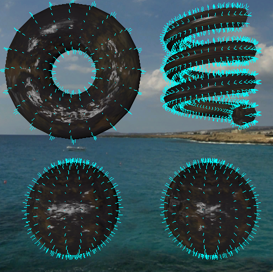

## Geometry Shader

Geometry Shader is an optional shader stage between vertex shader and fragment shader. It takes a set of vertices that form a primitive, then transform these vertices, form them to a primitive as its output.

### Geometry Shader Declaration
From [DirectX HLSL](https://docs.microsoft.com/en-us/windows/desktop/direct3dhlsl/dx-graphics-hlsl-geometry-shader), we use the following syntax to declare a geometry shader object:

[maxvertexcount (*NumVerts*)] void *ShaderName* ( *PrimitiveType* *DataType* Name [ *NumElements* ], inout *StreamOutputObject* );

- *NumVerts* is the number of output vertices
- *ShaderName* is main in our engine
- *PrimitiveType* determins the order of the primitive data, which needs to match the primitive we bind in c++
- *DataType* is input data type passed by vertex shader
- *NumElements* is the array size of the input, which depends on *PrimitiveType*
- [*StreamOutputObject*](https://docs.microsoft.com/en-us/windows/desktop/direct3dhlsl/dx-graphics-hlsl-so-type) is a template object that defines the stream data output from geometry shader. 

*PrimitiveType* has five values:
- point: operator only one vertex at a time
- line: operator two vertices that form a line
- triangle: operator three vertices that form a triangle
- lineadj: operator four vertices that form a line and the two adjacent lines
- triangleadj: operator six vertices that form a triangle and the two adjacent triangles

In our engine, a geometry shader can be defined as following:
~~~ c++
struct GS_IN
{
    // Input
    float4 i_position: SV_POSITION;
    float4 i_vertexPosition_world: SW_POSITION;
    float4 i_color: COLOR;
    float2 i_texcoord: TEXCOORD;
    float3 i_normal_world: NORMAL;
    float3 i_tangent: TANGENT;
    float3 i_bitangent: BITANGENT;
};

[maxvertexcount(3)]
void main(in const triangle GS_IN input[3], inout LineStream<GS_IN> outputStream
)
{
    // Output the same primitive
    // Use Append to add point
    outputStream.Append(input[0]);
    outputStream.Append(input[1]);
    outputStream.Append(input[2]);

    // Use RestartStrip to form primitive
    outputStream.RestartStrip();
}
~~~

### Add Geometry Shader to Render Pipeline
- Add the type of geometry shader to *ShaderTypes* and shader builder
- Add optional geometry shader path to effect builder
- Bind geometry shader when a material is bound if it has any geometry shader

It's more readable and convenient to wrap our input and output data into a struct and pass the array of the struct to geometry shader. However, we don't use the struct in our previous shader, so I made different vertex shader and fragment shader with wrap struct.

### Result

We can do many cool stuff by adding geometry shader, which we cannot implement by only vertex shader and fragment shader. 

<figure>
	
    <figcaption>Show Normal of a Vertex</figcaption>
</figure>


    ../assets/img/blog/RealtimeRendering/GeometryShader/2.png
    ../assets/img/blog/RealtimeRendering/GeometryShader/3.png

