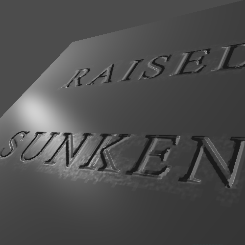

## PBR

### Add Normal Map to Pipeline

### Result


    ../assets/img/blog/RealtimeRendering/Assignment12/1.png
    ../assets/img/blog/RealtimeRendering/Assignment12/2.png
    ../assets/img/blog/RealtimeRendering/Assignment12/3.png
    ../assets/img/blog/RealtimeRendering/Assignment12/4.png
    ../assets/img/blog/RealtimeRendering/Assignment12/5.png
    ../assets/img/blog/RealtimeRendering/Assignment12/6.png



<figure>
	
    <figcaption>Another orientation</figcaption>
</figure>

<figure>
	
    <figcaption>Good looking normal maps</figcaption>
</figure>
