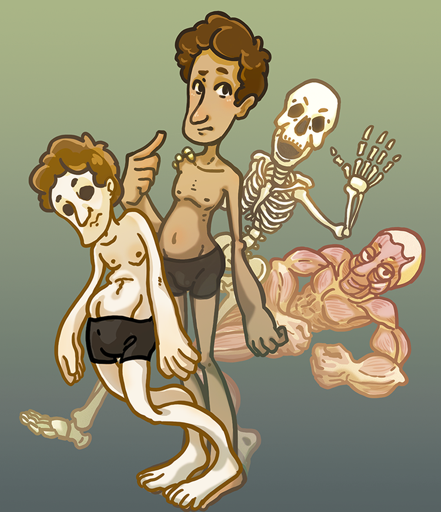

    
<!-- 
<a href="http://yuxian1996.github.io/"><b>Moon</b></a> is a minimal, one column jekyll theme.
 -->

{{site.bio}}

<a href="../assets/resume_AI.pdf" class="btn btn-info">Resume</a>

## Game Project

### [Meaty McSkinBones]({{ "/MeatyMcSkinBones" | prepend: site.baseurl }}){:.no-decoration}
A single-player puzzle/platformer where the character is split into three separate bodies.

<figure>
	
</figure>

### [And I Must Scream]({{ "/AndIMustScream" | prepend: site.baseurl }}){:.no-decoration}
A narrative puzzel game to overcome truma

<figure>
	
</figure>

### [Kudzu the Wild: A serious game about invasive species]({{ "/Kudzu-the-Wild" | prepend: site.baseurl}}){:.no-decoration}


    ../assets/img/project/KudzuTheWild/1.png
    ../assets/img/project/KudzuTheWild/2.png



## Program

### [Behavior Tree]({{ "/GameEngineering2-BehaviorTree" | prepend: site.baseurl}}){:.no-decoration}

### [Precomputed Radiance Transfer]({{ "/prt" | prepend: site.baseurl}}){:.no-decoration}

## [Blog]({{ "/posts" | prepend: site.baseurl}}){:.no-decoration}
